# **Agent Skills vs. MCP: ¿Competencia o Complemento? Una Mirada Profunda a la Arquitectura de Agentes IA**

## **📌 Introducción: La Nueva Frontera de los Agentes IA**

El ecosistema de la Inteligencia Artificial atraviesa una transformación fundamental. Ya no basta con modelos de lenguaje que simplemente "conversen"; la demanda actual es de **Agentes IA** que ejecuten tareas, tomen decisiones y operen de manera autónoma en el mundo real. Para lograr esto, dos tecnologías han emergido como pilares fundamentales:

*   **Model Context Protocol (MCP)**: Un protocolo estándar para conectar agentes a herramientas y datos externos.
*   **Agent Skills**: Un formato para empaquetar conocimiento y procedimientos expertos que guían al agente.

Una pregunta recurrente en la comunidad es: **¿Son tecnologías competentes o complementarias?** Este artículo argumenta que, lejos de ser una competencia "tipo VHS vs. Betamax", representan **capas arquitectónicas distintas pero sinérgicas**. La verdadera potencia de los agentes del futuro surgirá de su combinación inteligente, no de su elección mutuamente excluyente.

> **🤖 ¿Qué es un Agente IA?**
>
> **ChatGPT** es un modelo conversacional: responde preguntas y genera texto, pero es **reactivo** (espera input, procesa, responde). No ejecuta acciones ni se conecta a servicios externos.
>
> Un **Agente IA** combina un modelo de lenguaje con **herramientas y capacidades de ejecución**. Puede ejecutar código, acceder a APIs, crear archivos, actualizar bases de datos y seguir procedimientos autónomos de múltiples pasos.
>
> **Diferencia clave**: ChatGPT te aconseja; un Agente IA ejecuta tareas por ti. En este artículo exploramos cómo **MCP** y **Agent Skills** permiten construir estos agentes.

---

## **🧠 Entendiendo los Fundamentos: ¿Qué son MCP y Agent Skills?**

Para entender su relación, primero debemos definir claramente cada uno.

### **Model Context Protocol (MCP): El "Cable USB" de los Agentes**

**MCP** es un **protocolo de comunicación estándar y abierto**. Su función principal es **conectar** agentes IA (como Claude Desktop, Cursor o una aplicación personalizada) con herramientas, servicios y datos externos (bases de datos, APIs, sistemas de archivos, Slack, Notion) de una manera **consistente, segura y estandarizada**.

*   **Analogía**: Piensa en MCP como el **protocolo USB-C**. No importa qué dispositivo (impresora, disco duro, cámara) conectes, el puerto siempre funciona de la misma manera y está estandarizado. MCP hace lo mismo para los agentes: cualquier herramienta que "hable" MCP puede ser conectada y utilizada por cualquier agente que entienda el protocolo.
*   **Propósito**: Resolver el problema de la integración fragmentada. Sin MCP, conectar un agente a 10 servicios diferentes podría requerir 10 integraciones personalizadas. Con MCP, se convierte en una tarea mucho más sencilla y mantenible.
*   **Estructura**: Se basa en una arquitectura **cliente-servidor**. El servidor MCP expone herramientas (Tools), recursos (Resources) y plantillas de prompts (Prompts) que el cliente (el agente) puede descubrir y usar.

### **Agent Skills: El "Manual de Instrucciones" de los Agentes**

**Agent Skills** son **paquetes de conocimiento y procedimientos** diseñados para enseñar a un agente cómo realizar una tarea específica de manera experta y consistente. Un Skill es, en esencia, un archivo Markdown (*SKILL.md*) que puede incluir instrucciones, scripts, referencias y plantillas.

*   **Analogía**: Un Skill es como un **"manual de usuario" o un "libro de recetas"** especializado. No le da al agente una nueva capacidad per se, sino que le enseña **cómo usar sus capacidades existentes** (incluyendo las herramientas conectadas vía MCP) para lograr un objetivo específico de la mejor manera posible.
*   **Propósito**: Resolver el problema de la **falta de conocimiento experto y procedural** en los modelos base. Un LLM puede ser brillante, pero no sabe los procesos internos, las mejores prácticas o las convenciones de tu equipo. Un Skill inyecta ese conocimiento de forma estructurada y reusable.
*   **Estructura**: Su característica más potente es la **"divulgación progresiva" (Progressive Disclosure)**. Un Skill no se carga de golpe. Se hace en tres capas para ahorrar tokens y contexto:
    1.  **Capa de Metadatos**: Solo el nombre y la descripción del Skill. Se carga al inicio, permitiendo al agente saber qué habilidades tiene disponibles sin consumir muchos tokens.
    2.  **Capa de Instrucciones**: El contenido completo del *SKILL.md*. Solo se carga cuando el agente detecta que el Skill es relevante para la tarea actual.
    3.  **Capa de Recursos**: Scripts, documentos de referencia, plantillas. Se cargan solo si el *SKILL.md* los invoca explícitamente durante la ejecución.

---

## **⚖️ Argumento Central: Complemento, no Competencia**

La evidencia y la experiencia de la comunidad demuestran que MCP y Agent Skills son **tecnologías complementarias que operan en capas arquitectónicas diferentes**. Confundirlos como competidores es un error conceptual que lleva a arquitecturas deficientes.

### **1. Resuelven Problemas Fundamentales Diferentes**

| **Problema** | **Solución con MCP** | **Solución con Agent Skills** |
| :--- | :--- | :--- |
| **"¿Cómo conecto mi agente a 10 servicios diferentes sin escribir 10 integraciones?"** | **MCP proporciona el estándar**. Implementas un servidor MCP por servicio y cualquier agente cliente puede usarlos. | No es la herramienta adecuada. Un Skill podría instruir al agente sobre *cómo* usar una API, pero no resuelve el problema de la conexión estándar. |
| **"¿Cómo hago que mi agente siga siempre el proceso de revisión de código de mi equipo y no alucine?"** | Un servidor MCP podría exporner una herramienta *run_linter()*, pero no sabría **cuándo** ni **cómo** usarla según tu proceso. | **Un Agent Skills es perfecto**. El *SKILL.md* puede detallar: "1. Ejecuta el linter. 2. Comprueba los warnings X, Y y Z. 3. Asegúrate de que el mensaje de commit sigue el formato *[JIRA-XXX] Descripción*". |
| **"¿Cómo optimizo el uso de tokens? Mi contexto se llena rápido."** | MCP puede contribuir al problema si conectas muchos servidores, ya que cada uno carga las descripciones de sus herramientas al inicio, consumiendo miles de tokens. | **Agent Skills está optimizado para esto**. Gracias a la divulgación progresiva, solo carga lo esencial en cada momento, minimizando el consumo de tokens. |
| **"¿Cómo puedo empaquetar y compartir el conocimiento experto de mi empresa?"** | MCP no está diseñado para esto. Es un protocolo de conexión, no un formato de almacenamiento de conocimiento. | **Agent Skills es ideal**. Puedes crear un repositorio de Skills que capturen el conocimiento de tus equipos (ej. "Skill de auditoría de seguridad", "Skill de redacción técnica") y compartirlo fácilmente. |

### **2. La Comunidad y los Líderes de Opinión Abogan por la Combinación**

La discusión en foros técnicos, blogs de expertos y comunidades como Reddit y Hacker News es abrumadoramente a favor de la visión complementaria:

*   **Simon Willison**, una de las voces más respetadas en el espacio, ha argumentado que Skills y MCP son complementarios: Skills proporcionan flujos de trabajo específicos de dominio, mientras que MCP facilita conexiones a servicios. Ambos son útiles, y lo más convincente es cuando se combinan.
*   Un artículo técnico en **tty4.dev** argumenta: **"En mi opinión, ambos pueden existir uno al lado del otro: Skills son buenos para uso local para mostrar a los modelos cómo pueden asistir con el trabajo diario, mientras que MCP es agradable para las empresas que desean proporcionar acceso a sus servicios y tienen más control sobre la ruta de ejecución"**.
*   Una analogía común en la comunidad resume esto perfectamente: **Skills = 'Cómo hacer X' (Conocimiento), MCP = 'Cómo conectar Y' (Conexión). Tu agente necesita ambos para ser verdaderamente útil**.

### **3. El Argumento de la "Sinergia" es Más Fuerte que el de "Competencia"**

Imaginemos un escenario real: **Quieres un agente que automatice el análisis de los informes de ventas de tu empresa**. ¿Qué usarías?

*   **Enfoque MCP-Only**: Creas un servidor MCP que exponga herramientas para leer los informes de la base de datos y generar gráficos. El agente puede conectar a los datos, pero **no sabe** qué métricas son importantes, qué tendencias buscar o cómo tu empresa presenta los informes. Podría generar un informe técnico correcto pero totalmente inútil para tus stakeholders.
*   **Enfoque Skills-Only**: Creas un Skill detallado que dice "Busca estas tendencias, usa este formato, incluye estos gráficos". Sin embargo, el agente **no tiene acceso** a los datos frescos de la base de datos o a la librería de gráficos. Tendría que pedirle al usuario que le suba el informe, lo cual rompe la automatización.
*   **Enfoque Combinado (La solución ideal)**:
    1.  **MCP** conecta el agente a la base de datos de ventas y a una herramienta de generación de gráficos.
    2.  Un **Agent Skill** ("Analista de Ventas") instruye al agente: "Para crear el informe semanal: 1. Usa la herramienta *query_database* del servidor MCP para obtener los datos de las últimas 4 semanas. 2. Calcula las métricas A, B y C. 3. Usa la herramienta *create_chart* para generar el gráfico de líneas. 4. Compila todo en un informe con la estructura definida en la plantilla *assets/weekly_report_template.md*".

**Este ejemplo demuestra que la combinación crea un agente que es a la vez poderoso (gracias a MCP) y experto (gracias a Skills)**, algo que ninguna de las tecnologías podría lograr por sí sola de manera efectiva.

---

## **🧪 Ejemplos de Uso en el Mundo Real**

Para solidificar el argumento, veamos cómo funcionan en diferentes contextos.

### **Ejemplo 1: Agente de Desarrollo de Software**

| **Tarea** | **Rol de MCP** | **Rol de Agent Skills** |
| :--- | :--- | :--- |
| **Crear una nueva función en una API** | Conecta el agente al repositorio de código (via GitHub MCP) y a la documentación de la API. | Un Skill "Desarrollador Backend" instruye: "1. Lee el patrón de diseño en *references/backend_patterns.md*. 2. Escribe la función siguiendo los estándares de la empresa (ver *SKILL.md*). 3. Escribe pruebas unitarias usando el framework definido. 4. Abre un Pull Request y usa la plantilla en *assets/pr_template.md*." |
| **Investigar un bug** | Conecta al sistema de issue tracking (Jira MCP) y a un servidor MCP que proporcione acceso a logs del sistema. | Un Skill "Cazador de Bugs" guía: "1. Reproduce el error localmente. 2. Busca en los logs usando *grep* con los patrones en *references/common_errors.txt*. 3. Identifica la causa raíz usando el flujo de decisión en *SKILL.md*. 4. Propón una solución y verifícala." |

### **Ejemplo 2: Agente de Marketing Digital**

| **Tarea** | **Rol de MCP** | **Rol de Agent Skills** |
| :--- | :--- | :--- |
| **Lanzar una campaña en redes sociales** | Conecta a las APIs de Twitter, LinkedIn, Facebook (via sus respectivos servidores MCP). | Un Skill "Community Manager" define: "1. Adapta el mensaje base a cada red siguiendo las guías de tono en *references/brand_voice.md*. 2. Programa las publicaciones para los horarios óptimos. 3. Incluye los hashtags relevantes de la lista en *assets/hashtag_library.csv*. 4. Monitoriza las menciones usando la herramienta *listen_to_mentions* del servidor MCP de Twitter." |
| **Analizar el rendimiento de una campaña** | Conecta a Google Analytics y a la herramienta de email marketing (via MCP). | Un Skill "Analista de Marketing" instruye: "1. Extrae las métricas clave (CTR, CPC, Conversión) usando las consultas definidas en *scripts/analytics_queries.sql*. 2. Compáralas con los benchmarks de la industria en *references/benchmarks.md*. 3. Genera un informe de insights usando la plantilla en *assets/performance_report.md*." |

---

## **🧭 Implicaciones para el Futuro de la Arquitectura de Agentes**

El reconocimiento de MCP y Agent Skills como capas complementarias tiene profundas implicaciones para cómo diseñamos y construimos sistemas de agentes:

1.  **Mayor Estándarización y Componibilidad**: La comunidad está moviéndose hacia un futuro donde los Agentes sean composiciones modulares de **Capas de Conexión (MCP)** y **Capas de Conocimiento (Skills)**. Esto hará que los agentes sean más fáciles de construir, mantener y compartir.
2.  **El Surgimiento de "Arquitectos de Agentes"**: Los desarrolladores y arquitectos de sistemas necesitarán pensador más en términos de "qué capas necesito" y "cómo las orquesto", en lugar de "qué modelo de lenguaje uso". La habilidad clave será diseñar Skills efectivos y conectar servicios via MCP de manera segura y eficiente.
3.  **Énfasis en la Seguridad y la Gobernanza**: Dado que ambas tecnologías introducen nuevas superficies de ataque (ej. el "tool poisoning" en MCP o la ejecución de scripts en Skills), la seguridad se volverá una parte fundamental del diseño de agentes desde el día uno. Las empresas necesitarán políticas claras sobre qué Skills se pueden usar y qué servidores MCP se pueden conectar.
4.  **Democratización de la Creación de Agentes**: Agent Skills, en particular, tiene el potencial de democratizar la creación de agentes. Un experto en dominio (ej. un abogado, un médico, un contador) podría crear un Skill que encapsule su conocimiento, permitiendo que un no-programador construya un agente poderoso en su área sin escribir código.

---

## **✅ Conclusión: Un Futuro de Integración**

La evidencia es clara: **Model Context Protocol y Agent Skills no son rivales, sino aliados naturales**. MCP es el sistema circulatorio y nervioso que conecta al agente con el mundo. Agent Skills es el cerebro experto y la memoria muscular que le permite actuar de forma inteligente y deliberada.

La pregunta no debería ser "¿MCP o Skills?", sino **"¿Cómo puedo combinar MCP y Skills para construir el agente más capaz y robusto para mi caso de uso?"**.

La arquitectura de agentes del futuro será una **capa de orquestación** (el cerebro que decide qué hacer) que coordina:
*   **Conocimiento experto** proveniente de una biblioteca bien curada de Agent Skills.
*   **Acciones y conexiones** provistas por un ecosistema de servidores MCP robustos y seguros.

Aquellos que entiendan y dominen esta arquitectura combinada estarán mejor posicionados para construir la próxima generación de aplicaciones de IA que no solo conversen, sino que **actúen, razonen y entreguen valor real en el mundo**.

---

## **🔗 Referencias y Recursos Adicionales**

*   **Especificación Oficial de Agent Skills**: [agentskills.io](https://agentskills.io/specification)
*   **Blog de Simon Willison sobre Skills**: [simonwillison.net/tags/skills](https://simonwillison.net/tags/skills)
*   **Sitio Oficial de MCP**: [modelcontextprotocol.io](https://modelcontextprotocol.io)
*   **Artículo "Agent Skills - a thin alternative to the Model Context Protocol?"**: [tty4.dev](https://tty4.dev/development/2025-12-13-skills-or-mcp)
*   **Artículo sobre seguridad en MCP**: [Model Context Protocol has prompt injection security problems](https://simonw.substack.com/p/model-context-protocol-has-prompt)
